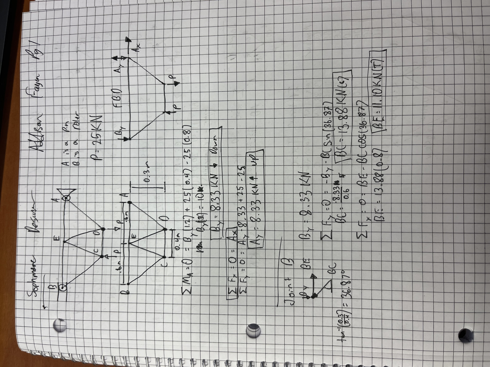
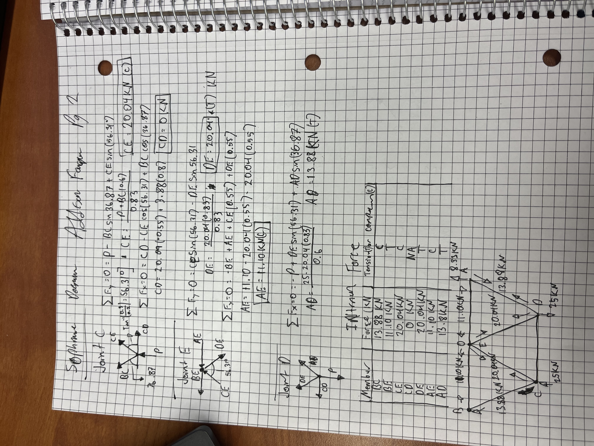
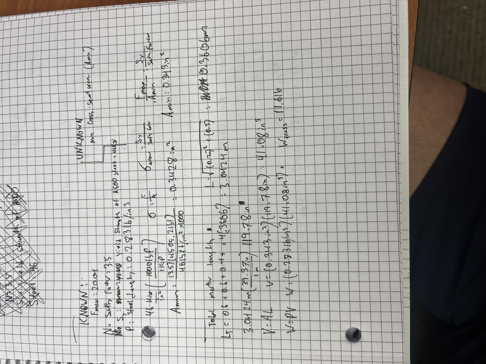
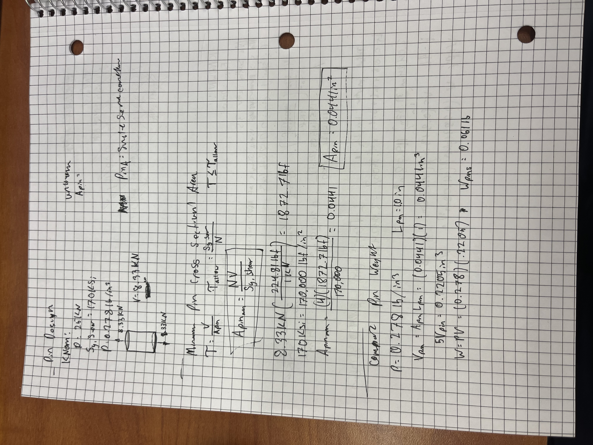
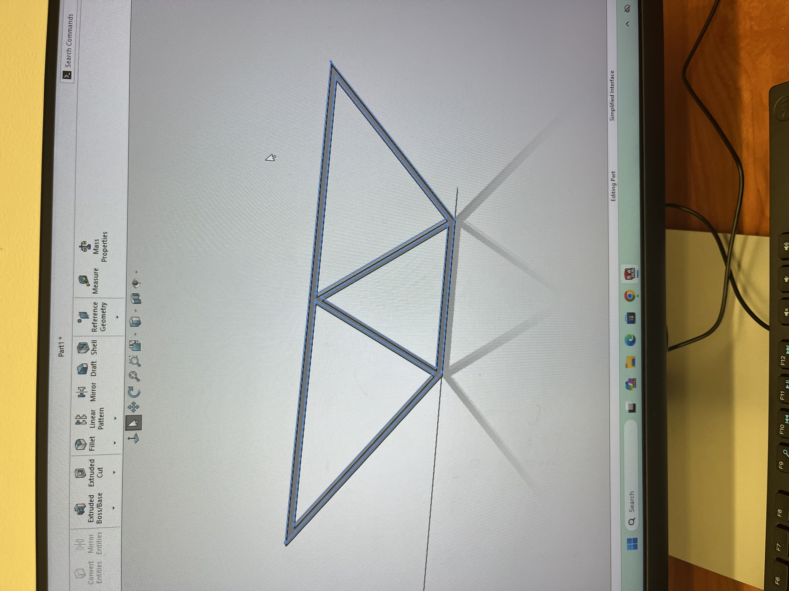
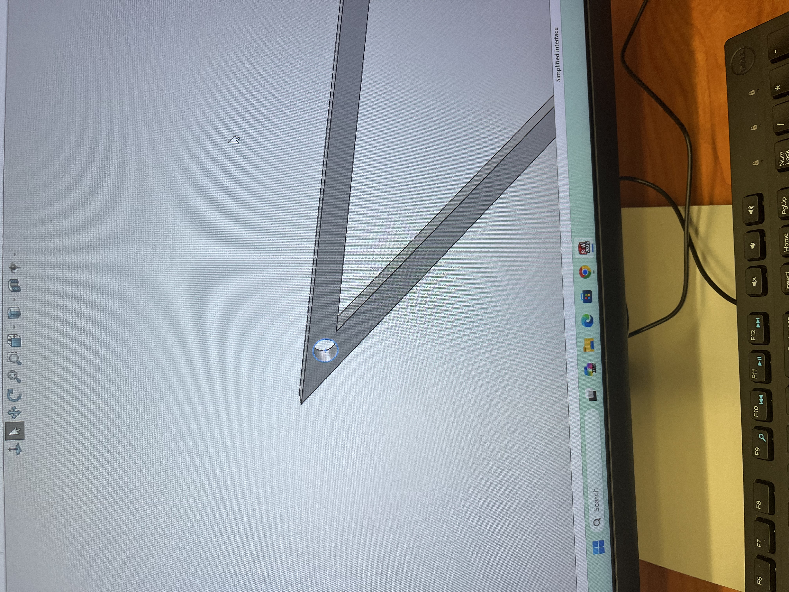
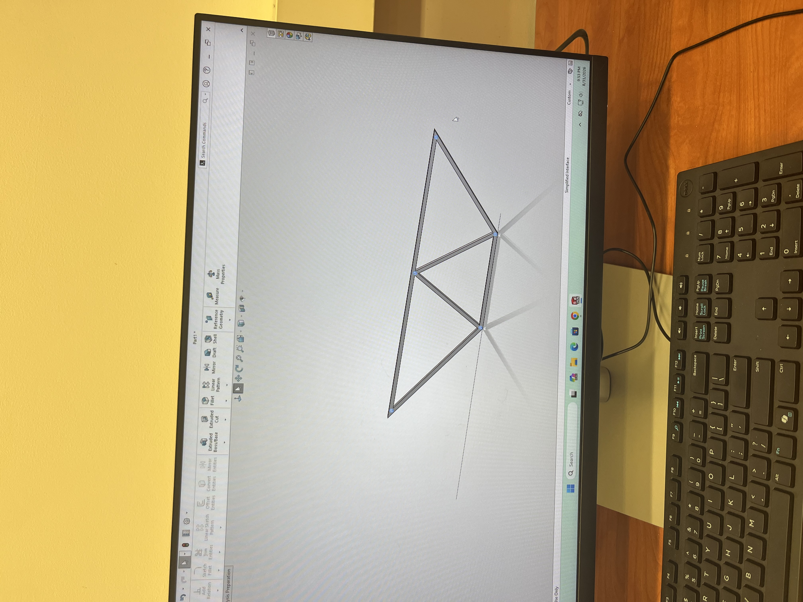

# A2 – Truss Stress Analysis

## Objective
The objective of this project was to design and analyze a lightweight planar truss that satisfied all geometric and loading constraints. Using static equilibrium equations and the method of joints, I determined the internal axial forces throughout each member. I then applied the governing maximum internal force alongside the required factor of safety to size the minimum allowable cross-sectional areas for both the structural members and their connecting pins. Finally, I developed a 3D CAD model of the optimized truss assembly to determine its total mass and validated the CAD data against my analytical calculations.

## Analyze
## Truss Reaction and Joint Force Analysis
To determine the support reactions at pins A and B, I first constructed a complete free-body diagram of the truss and applied the equations of static equilibrium . With the external reactions established, I performed a method of joints analysis across the structure to solve for the internal member forces. At each individual joint, I evaluated concurrent force equilibrium, breaking down inclined members into their respective Cartesian components using the truss geometry and utilizing the directional signs of the calculated forces to identify whether each member was loaded in tension or compression.
Using the method of joints, I applied $\sum F_x = 0$ and $\sum F_y = 0$ at each pin, resolving angled members into orthogonal components to calculate internal forces and classify each member in tension or compression. In the images below, you can also see how I broke down each joint and member.

## Member Sizing, Geometry, and Weight Optimization
After calculating all internal member forces, I evaluated their magnitudes to identify the critical governing load for the structural design. The maximum internal force was 20.04 kN, occurring in members CD and DE. Applying this critical load alongside a safety factor of 3.5 on the material's yield strength, I established the allowable stress limit and determined a minimum required cross-sectional area of 0.343 in². To maintain manufacturing consistency across the assembly, this calculated cross-sectional area was uniformly applied to every member in the truss. To determine the overall structural mass, I first calculated the diagonal member lengths using the Pythagorean theorem with orthogonal dimensions of $a = 0.4\text{ m}$ and $b = 0.3\text{ m}$, yielding a diagonal length of $0.3606\text{ m}$. Summing the lengths of all seven structural members resulted in a total cumulative length of $3.0424\text{ m}$. I converted this total length to inches to maintain dimensional consistency with the cross-sectional area and material density. Using $V = A \cdot L$, I calculated the total material volume of the truss members to be $41.08\text{ in.}^3$. Finally, applying the density of structural steel ($\rho = 0.2831\text{ lb/in.}^3$) into $W = \rho V$, I calculated a total analytical truss weight of $11.61\text{ lb}$.

## Connecting Pin Sizing and Shear Analysis
To design the connecting pins, I identified the governing load case using the maximum reaction force and modeled each connection as a single shear joint fabricated from hardened tool steel. Applying the shear stress formula alongside a required a safety factor of 4 against the material properties, I calculated the minimum allowable pin cross-sectional area. Using this determined geometry and the tool steel density of 0.278 lb/in³, I then evaluated the total volume and mass of the fasteners, resulting in a combined pin weight of 0.061 lb.

## CAD work
To model the truss in SolidWorks, I began by sketching the centerline geometry and member profile based on the analytical design dimensions and the calculated minimum cross-sectional area. I then used an extruded boss/base feature to generate the solid, unified 3D truss frame, creating uniform members throughout the structure. Next, I added extruded cuts at each node to incorporate the pin holes sized according to the shear connection calculations. I was unable to apply structural steel material properties to the CAD model to evaluate its final mass and volume, so I was unable to compare my calculated numbers to the cad ones.

## Decide
_Which geometry did you select, and why? This is your first open design choice in the course — defend it._

## Communicate

