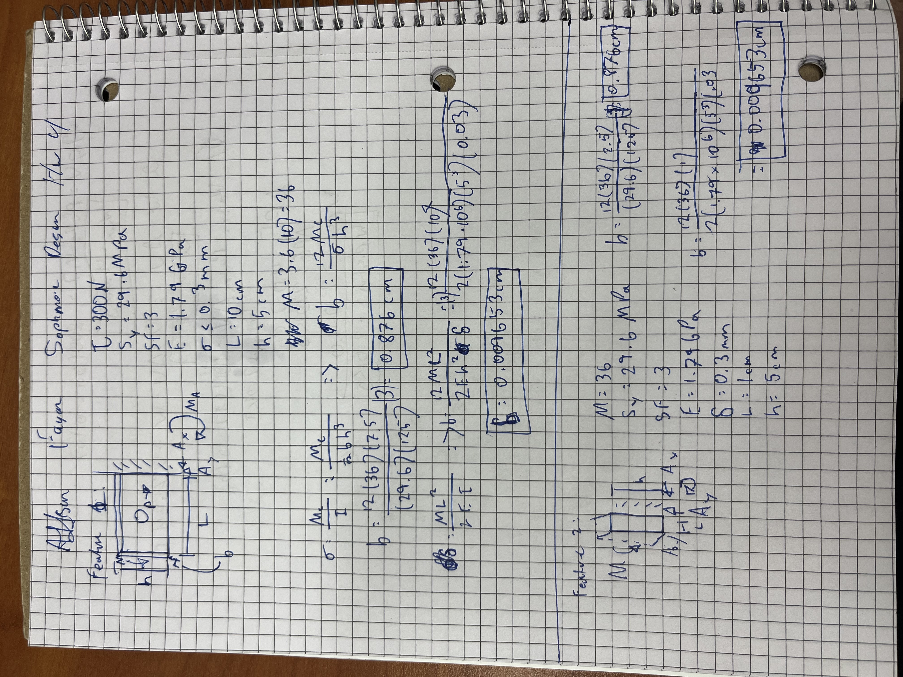
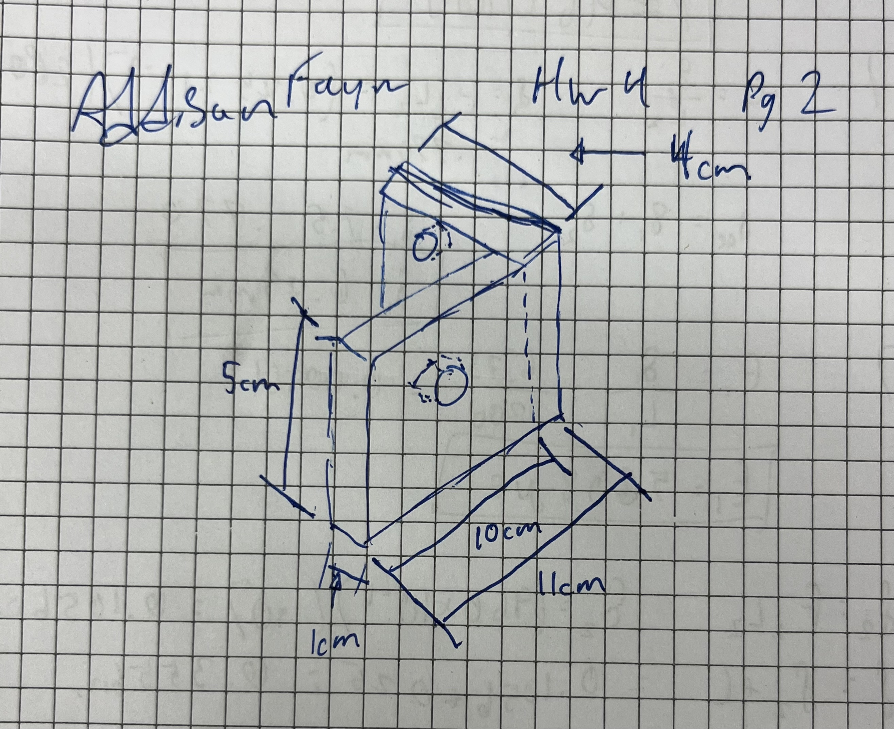
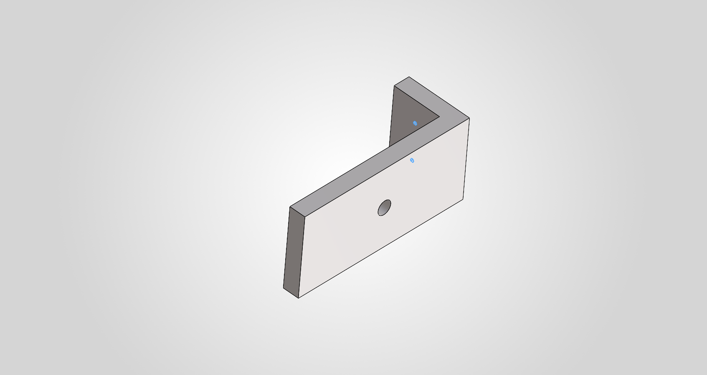

# A4 – [Topic]

## Objective
The objective of this assignment is to design, size, and document a functional motor mount for a 24V DC gear motor subjected to a 300 N shaft load while securely fastened to a rigid wall. Using beam bending and deflection theories, the mount geometry is analytically evaluated under two governing criteria: material yield strength with a factor of safety of 3 and a maximum allowable free end deflection limit of 0.30 mm. Both structural features, the motor interfacing member and the wall mounting bracket, are solved symbolically and numerically for cross sectional dimensions using an engineering thermoplastic such as ABS, PETG, or PLA. Finally, the validated design is realized through a parametric 3D CAD model incorporating mounting clearance holes and deflection minimizing features, followed by a fully dimensioned ASME standard multiview drawing.

## Analyze

## Feature 1
For Feature 1 (in IMG_4118.jpeg), I set the height to 5 cm and the length to 10 cm, choosing ABS with an elastic modulus of 1.79 GPa. I analyzed the part for both bending stress and deflection using the beam equations sigma = Mc/I and delta = ML^2 / (2EI), where the moment of inertia is I = b*h^3 / 12. After applying the required safety factor of 3, the stress calculation showed that the base needed to be at least 0.876 cm, while the deflection calculation required a minimum of 0.00965 cm. Since the stress requirement was larger, it controlled the design, so I rounded the base up to 1 cm. This resulted in final dimensions of 1 cm for the base, 5 cm for the height, and 10 cm for the length.

## Feature 2
For Feature 2 ( in IMG_4118.jpeg), I set the height to 5 cm and the length to 1 cm to ensure there was enough space for bolt holes to secure the motor mount to the wall. Sizing this section to provide a strong connection to the rigid support resulted in a base width of 4 cm. This gave final dimensions for Feature 2 of 4 cm for the base, 5 cm for the height, and 1 cm for the length.

## Sketch
Before building the CAD model, I drew an isometric sketch of the motor mount (in IMG_4119.jpeg) using the dimensions found from Features 1 and 2. This sketch shows the overall shape of the bracket, how the two sections connect together, and where the mounting holes and motor shaft opening are located.

## CAD work
In the imige below is the start of the prosses of the cad work
A4MotorMountAddisonFaganpng.PNG

Here is the link to the finished cad work:

## Communicate
This assignment took me about 5 hours, the big time suck as haveing to restart the cad drawing a few times
