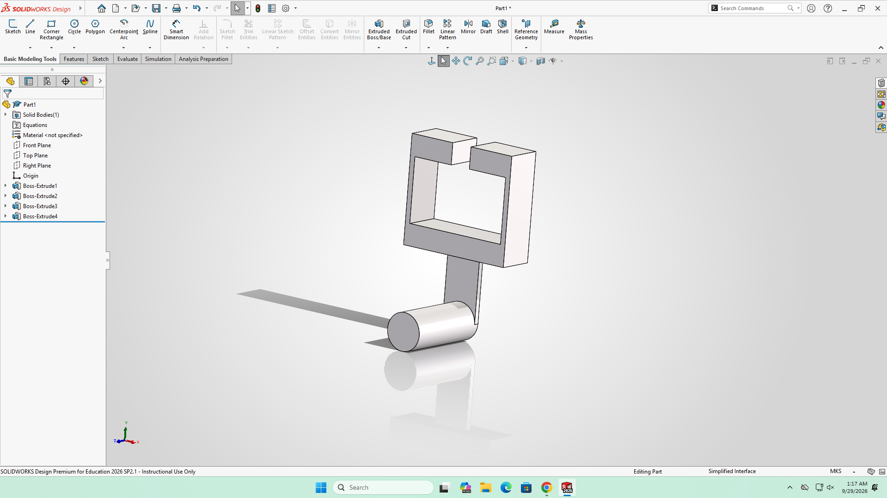

# A6 – [Topic]

## Objective
For this assignment, we’re taking the dimensions we figured out last week for a T fitting bracket and turning them into a 3D model, plus making an engineering drawing. Last week, we had to calculate the bracket’s size based on the T fitting measurements and the load it had to hold. Now, we're using those numbers to build the part in 3D and then put together a drawing sheet using third-angle projection on an ANSI B sheet

## Analyze
For my bracket, I first took my sketch form last week and double checked my dimensions to make sure everything fit right. Then, using a lot of lines, individual cuts, and extrudes, I made the 3D model of the part that you see below to the exact specifications of my sketch.

Here is the link to that part file 

## Decide

## Communicate

