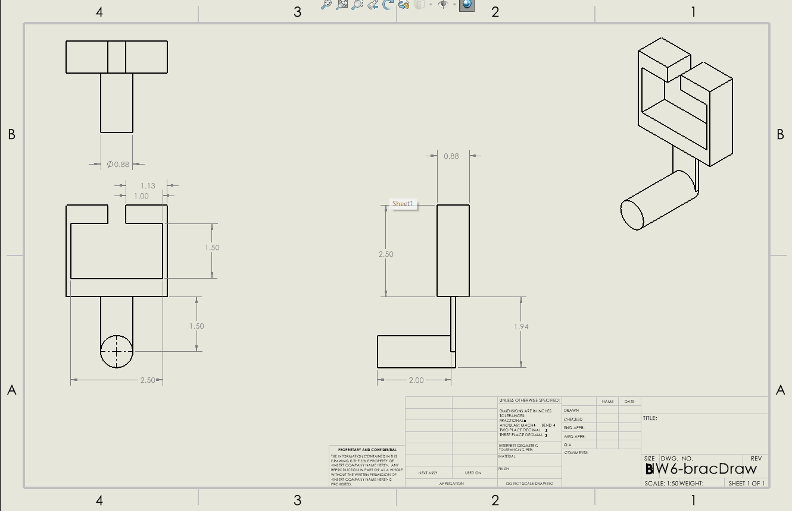

# A6 – [Topic]

## Objective
For this assignment, we’re taking the dimensions we figured out last week for a T fitting bracket and turning them into a 3D model, plus making an engineering drawing. Last week, we had to calculate the bracket’s size based on the T fitting measurements and the load it had to hold. Now, we're using those numbers to build the part in 3D and then put together a drawing sheet using third-angle projection on an ANSI B sheet

## Parametric Design (CAD)
For my bracket, I first took my sketch form last week and double checked my dimensions to make sure everything fit right. Then, using a lot of lines, individual cuts, and extrudes, I made the 3D model of the part that you see below to the exact specifications of my sketch.

Here is the link to that part file 

## Drawing (CAD)

After finishing the 3D model of the bracket, I opened up SolidWorks' drawing tool and picked the ANSI B template. Then, I set up the four main views: front, right side, top, and an isometric view. Finally, I added in all the key dimensions that were needed to fully show the part.

Here is the link to the Drawing file

## Communicate
During my design and building process, I used the beam deflection equation to figure out the required height for Feature C. The math gave me 0.316 inches, but I decided to bump it up to 0.50 inches just to add a bit of extra material as a safety cushion and keep the dimension clean and simple. This worked a lot better for the design and should alow everything to fit together properly.

For the T-fitting gap width, I gave it a slightly looser tolerance so the fitting has enough breathing room to slide in smoothly without being sloppy or unstable. Based on the tolerances for "a" and "b," the calculated width came out to 2.4965 inches. For it is so close to the actual dimension I used, I'm going to have to be very precise and err on the larger side to make it actually assemblable.

All in all, this homework took about 4 hours, most of that time deeling wth error on github.
